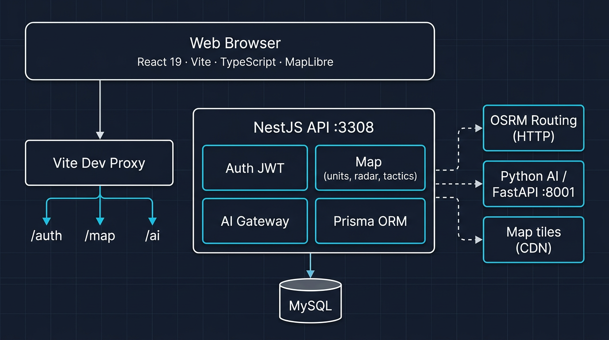
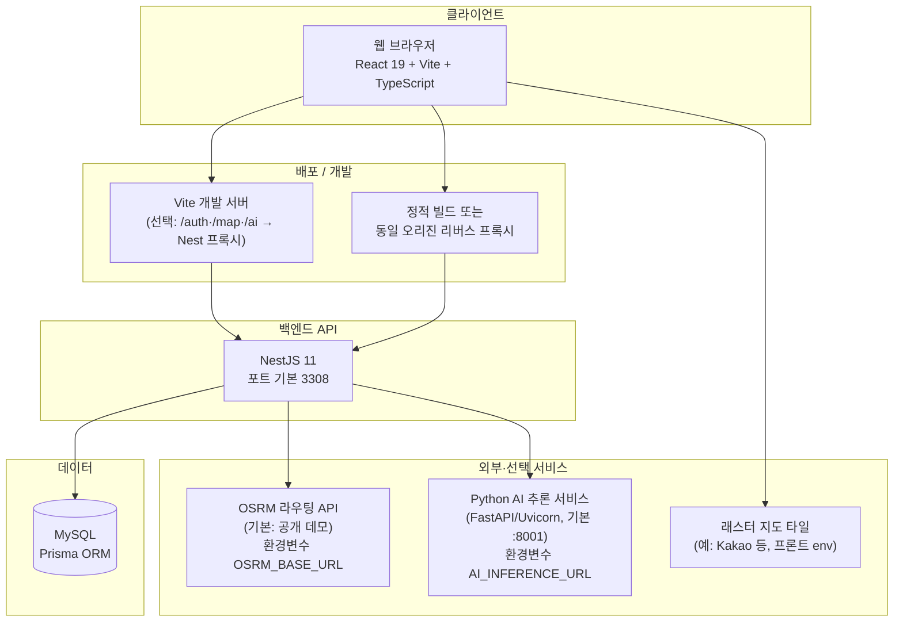
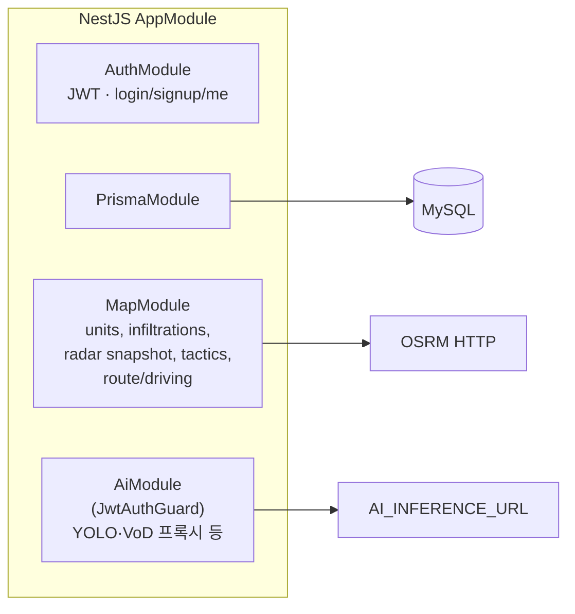
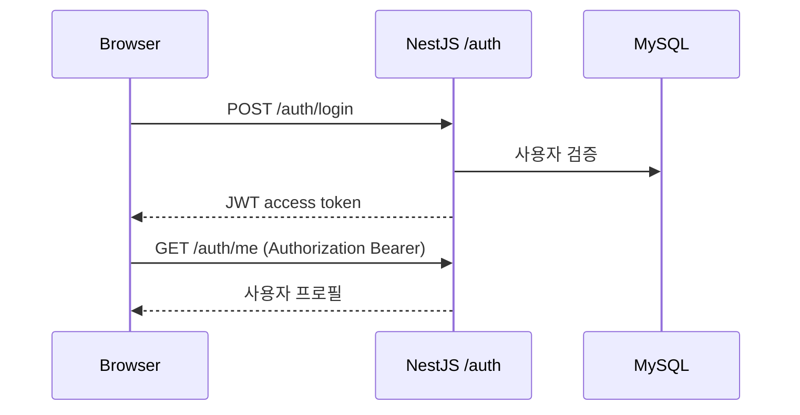
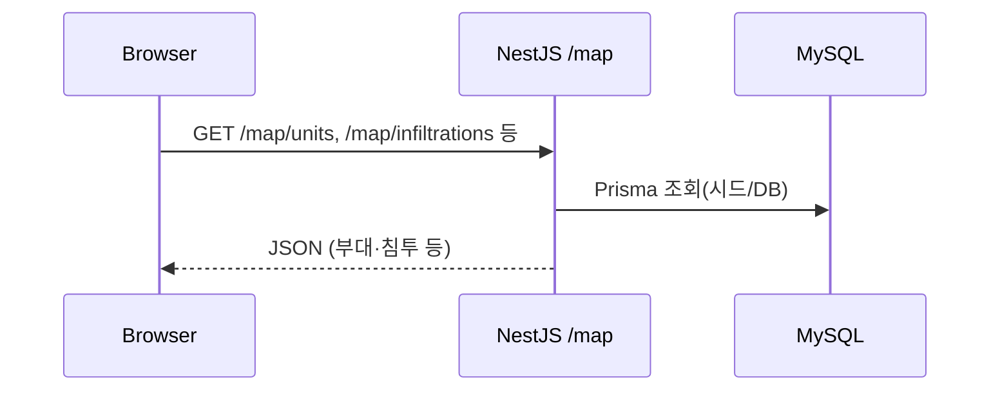
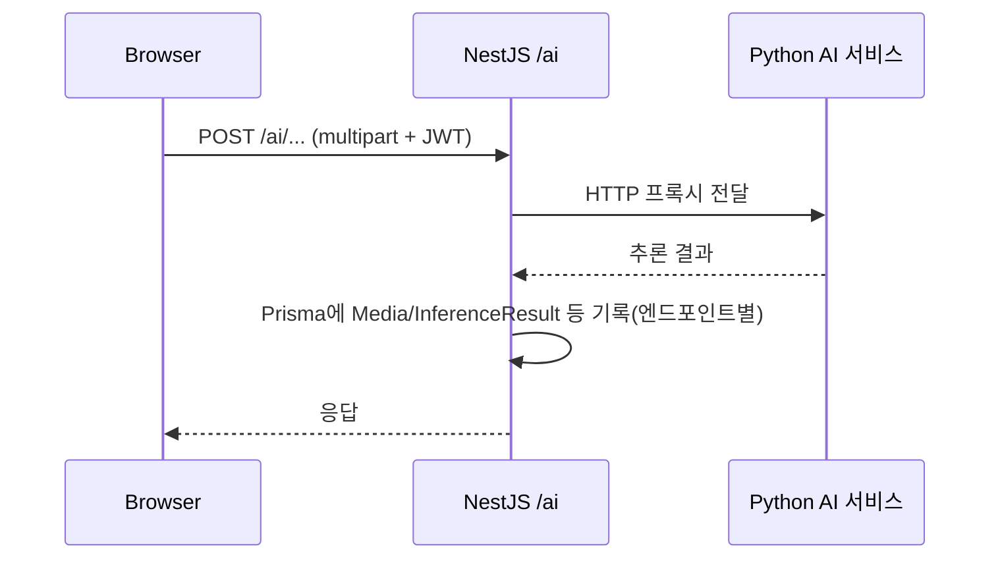
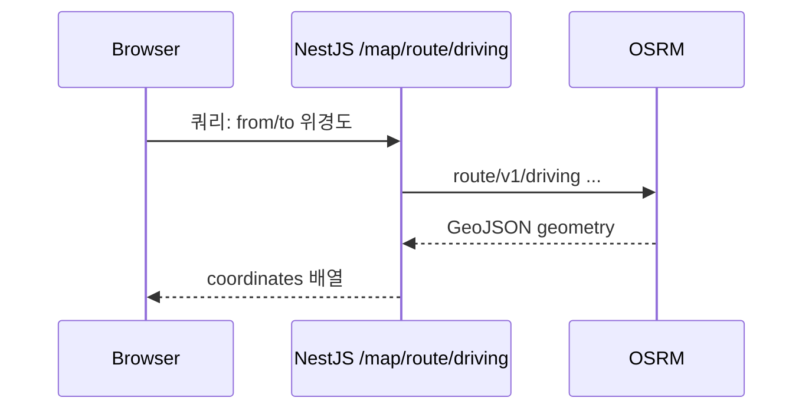

# 전장 C2 웹 시스템 아키텍처

본 문서는 저장소 기준으로 **현재 구현된** 프론트엔드·백엔드·연동 서비스의 구조를 정리합니다. (연구용 `vod-devkit` 등 오프라인 파이프라인은 런타임에 필수는 아님.)

---

## 1. 구조 개요 (이미지)

고수준 블록 다이어그램은 아래 파일을 참고하세요.

---

## 2. 시스템 맥락 (C4 Context)

---

## 3. 컨테이너·모듈 (NestJS)

| 모듈 | 역할 |
|------|------|
| **AuthModule** | 회원가입·로그인, JWT 발급, `/auth/me` |
| **MapModule** | 아군/침투 표적 조회, 레이더 스냅샷, 전술 추천·결정, 주행 경로(백엔드에서 OSRM 호출) |
| **AiModule** | 업로드 기반 추론·복원 등을 **별도 Python 서비스**로 위임, 결과·메타는 Prisma로 저장 가능 |
| **PrismaModule** | User, Media, InferenceResult, 전술 유닛/침투 등 도메인 모델 접근 |

---

## 4. 프론트엔드 구조

| 영역 | 기술 | 설명 |
|------|------|------|
| UI | React 19, TypeScript | 단일 SPA, `react-router-dom` 라우팅 |
| 빌드 | Vite 7 | 개발 시 API는 `vite.config.ts`의 `/auth`, `/map`, `/ai` 프록시로 Nest에 전달 |
| API URL | `getApiBaseUrl()` (`frontend/src/apiBaseUrl.ts`) | `VITE_API_BASE_URL` → 개발 빈 문자열(동일 오리진+프록시) → 프로덕션은 `window.location.origin` 등 |
| 지도 | MapLibre GL, mgrs | 전장판·GeoJSON 레이어, 좌표 readout |
| 정적 자산 | `frontend/public/media` | 시연용 영상·이미지 |

주요 화면은 `App.tsx` 중심의 전장 서비스 페이지와 이론·센서 관련 라우트로 구성됩니다.

---

## 5. 대표 요청 흐름

### 5.1 로그인·세션

### 5.2 전장판 데이터

### 5.3 AI 추론 (보호 API)

### 5.4 도로 경로 (드론/UAV 시뮬 등)

---

## 6. 환경 변수 요약

| 변수 | 용도 |
|------|------|
| `DATABASE_URL` | Prisma → MySQL |
| `JWT_*` / Nest auth 설정 | 토큰 서명·만료 등 (백엔드 코드·env 참고) |
| `PORT` / `HOST` | Nest 수신 (기본 3308) |
| `FRONTEND_ORIGIN` | 프로덕션 CORS 허용 오리진 |
| `AI_INFERENCE_URL` | Nest `AiService` → Python 서비스 베이스 URL (기본 `http://localhost:8001`) |
| `OSRM_BASE_URL` | 주행 경로 OSRM 인스턴스 (미설정 시 공개 데모) |
| `VITE_API_BASE_URL` | 프론트가 API를 호출할 절대 베이스 URL (선택) |
| `VITE_KAKAO_MAP_APP_KEY` 등 | 지도 타일/키 (프론트) |

---

## 7. 관련 문서·코드 진입점

- 스택 한눈에: `PROJECT_TECH_STACK.md`
- Nest 모듈 결선: `backend/src/app.module.ts`
- API 베이스 URL 규칙: `frontend/src/apiBaseUrl.ts`, `frontend/vite.config.ts`
- DB 스키마: `backend/prisma/schema.prisma`

---

## 8. 이미지 파일

| 파일 | 설명 |
|------|------|
| `docs/architecture-overview.png` | 상단 다이어그램과 동일한 고수준 구조도 (PNG) |

Mermaid 원본은 본 MD의 코드 블록을 [Mermaid Live Editor](https://mermaid.live) 등에 붙여넣어 수정·보내기 할 수 있습니다.
