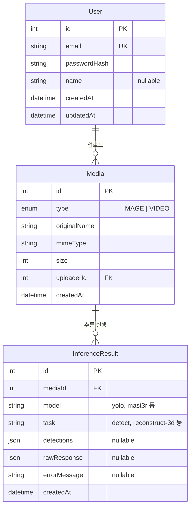
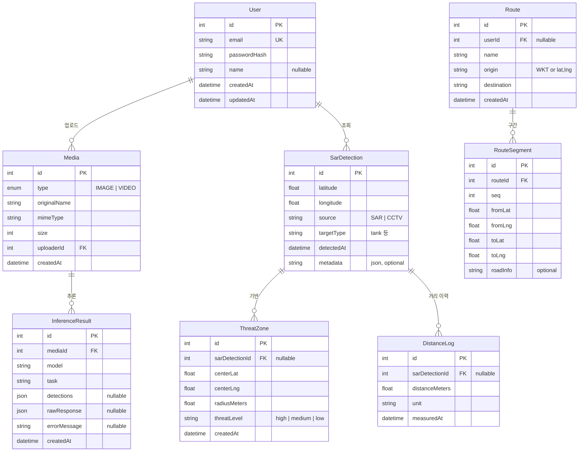

# 데이터베이스 ERD (Entity Relationship Diagram)

SAR·CCTV 다중 센서 융합 관제 솔루션 — 현재 스키마 및 확장 예정 엔티티 기준.

---

## ERD 시각화 방법

아래 다이어그램은 **Mermaid** 문법으로 작성되어 있습니다. 다음 방법으로 시각화할 수 있습니다.

| 방법 | 설명 |
|------|------|
| **브라우저에서 HTML 뷰어** | `docs/ERD-viewer.html` 파일을 브라우저로 열면 두 개의 ERD가 자동 렌더링됩니다. (더블클릭 또는 드래그로 열기) |
| **Cursor / VS Code** | 확장 프로그램 **Markdown Preview Mermaid Support** 또는 **Mermaid** 설치 후, `ERD.md`를 연 뒤 마크다운 미리보기(Ctrl+Shift+V 또는 우클릭 → Open Preview)로 열면 다이어그램이 표시됩니다. |
| **Mermaid Live Editor** | [mermaid.live](https://mermaid.live) 접속 → 이 문서의 ` ```mermaid ` 블록 내용을 복사해 붙여넣기 → 실시간 미리보기 및 PNG/SVG 내보내기 가능. |
| **GitHub / GitLab** | 이 `.md` 파일을 저장소에 푸시하면 GitHub·GitLab이 Mermaid를 자동 렌더링합니다. |

---

## 1. 현재 구현된 ERD (Prisma 스키마 기준)



---

## 2. 테이블 요약 (현재)

| 테이블 | 설명 | 연동 화면 |
|--------|------|-----------|
| **User** | 로그인/회원가입 사용자. 미디어 업로드·추론 이력 소유자. | 로그인, 회원가입, 전역 |
| **Media** | 이미지/영상 메타데이터. 실제 파일은 스토리지, DB에는 메타만 저장. | 전차 식별/추적, 3D 모델링(MASt3R) |
| **InferenceResult** | YOLO 검출, 3D 복원 등 AI 추론 결과(JSON). media 1:N. | 전차 식별/추적, 3D 모델링(MASt3R) |

---

## 3. 확장 예정 ERD (SAR 지도·거리 분석·위협/경로)

6주 계획 및 웹 탭(홈 SAR 지도, 거리 분석, 위험지역·경로) 반영 시 추가될 수 있는 엔티티.



---

## 4. 확장 엔티티 요약 (예정)

| 테이블 | 설명 | 연동 화면 |
|--------|------|-----------|
| **SarDetection** | SAR/항공·CCTV 기반 전차 검출 표적 좌표(위·경도). 한반도 투영 시나리오용. | 홈 (SAR 지도) |
| **ThreatZone** | 표적 기준 위협 반경(포탄 사거리 등). 지도 위 시각화. | 홈, 거리 분석 |
| **DistanceLog** | 객체별·시간축 거리 추정 이력. 임계 거리 경고와 연동. | 거리 분석 |
| **Route** | 사용자/시나리오별 경로(출발·도착). 도로 기반 경로 탐색 결과. | 홈, 거리 분석 |
| **RouteSegment** | 경로 구간(위경도·도로 정보). 경로 시각화·재생. | 홈, 거리 분석 |

---

## 5. 관계 요약

| 관계 | 설명 |
|------|------|
| User → Media | 1:N. 사용자별 업로드 미디어 목록. |
| Media → InferenceResult | 1:N. 동일 미디어에 대한 다중 추론(YOLO, 3D 등) 허용. |
| SarDetection → ThreatZone | 1:N. 검출 표적별 다수 위협 영역. |
| SarDetection → DistanceLog | 1:N. 표적별 시간에 따른 거리 로그. |
| Route → RouteSegment | 1:N. 경로별 구간 순서(seq). |
| User → Route | 1:N (선택). 사용자별 저장 경로. |

---

## 6. 비고

- **파일 저장**: 이미지/영상/PLY 등 실제 파일은 스토리지(로컬 또는 S3 등)에 두고, DB에는 경로·메타만 저장하는 방식 유지.
- **좌표계**: SarDetection, ThreatZone, Route 등은 WGS84(위·경도) 기준으로 한반도 지도 투영에 맞춤.
- **구현 순서**: 현재는 User, Media, InferenceResult만 Prisma에 정의되어 있으며, SAR·거리·경로 관련 테이블은 지도/거리 분석 기능 구현 시 스키마에 추가 예정.
